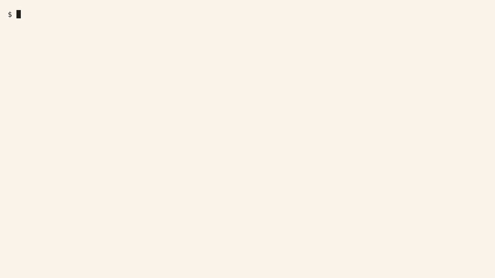

<p align="center">
  
</p>

<h1 align="center">Cardea</h1>

<p align="center">
  <b>A free security scanner for Claude Code skills.<br>
  46 checks, one command, a 0-100 score, and a hard DO-NOT-INSTALL gate when it finds something dangerous.</b>
</p>

<p align="center">
  
  
  
  
  
</p>

Paste any Claude Code skill folder in. Get a 0-100 quality score, a DO-NOT-INSTALL safety gate, auto-remediation previews, and self-contained SVG badges.

```bash
python3 scripts/cardea.py <skill-folder>
```

*Standard-library Python 3. Zero dependencies. No API keys. No network. It never runs the target skill's code: every finding comes from reading files as data.*

**Why this exists:** our Phase 1 audit found 73% of sampled community skills broken or risky. Skills are just files anyone can publish, and nothing forces them to be safe or even functional before you install them. Cardea is the check nobody was running.

*Tip: scan individual skill folders. If you point it at a multi-skill collection, it will tell you and list the skill folders it found.*

---

## Demo: behind the scenes

<p align="center">
  <a href="assets/demo/cardea-demo.mp4">
    
  </a>
  <br>
  <b><a href="assets/demo/cardea-demo.mp4">▶ Watch the full demo (79 s)</a></b>
</p>

The recording is a real audit run, not a mockup. It opens with what Cardea is and what it checks, then walks a benign skill fixture through to a 98/100 EXCELLENT (one LOW finding: a missing `LICENSE.txt`), then a deliberately malicious fixture scoring 0/100 BROKEN / RISKY with the DO-NOT-INSTALL gate tripped on 6 CRITICAL findings, then a `--fix` dry-run preview and the SVG badges it writes. Every number on screen matches the JSON report Cardea actually produced at recording time.

---

## Key features

- **Spec validation:** verifies official `SKILL.md` frontmatter, metadata schema, and required fields.
- **Dead-path detection:** finds missing or broken script and file references before you ever install the skill.
- **Threat and injection scanning:** 46 checks (31 behavioral regex patterns + 15 unicode steganography characters) covering prompt injection, instruction overrides, interpreter pipes, obfuscated execution, split-flag destructive commands, and credential exfiltration.
- **Advisory safety gate:** any CRITICAL finding caps the score below 50 and flags an explicit **DO NOT INSTALL** warning.
- **SVG score badges:** clean, self-contained SVG badges that render anywhere, no network needed.
- **Auto-remediation (`--fix`):** previews and applies safe mechanical fixes (`chmod +x`, UTF-8 BOM stripping, frontmatter and license stubs).
- **GitHub CI action:** drop-in composite action (`action/action.yml`) to audit incoming pull requests automatically.

## Quick start

Run Cardea against any local agent skill directory using Python 3:

```bash
# Run the full static audit and write the JSON report
python3 scripts/cardea.py <target-skill-folder> --json report.json

# Generate an SVG score badge
python3 scripts/cardea.py <target-skill-folder> --badge score.svg

# Preview safe mechanical fixes (dry-run mode, nothing touches disk)
python3 scripts/cardea.py <target-skill-folder> --fix

# Apply mechanical fixes and view the re-scan score delta
python3 scripts/cardea.py <target-skill-folder> --fix --apply
```

`--fix` only ever touches the mechanical, unambiguous stuff: exec bits, name-field mismatches, BOMs, stub files. It never rewrites logic, and it refuses to follow symlinks outside the skill root.

## What it checks

Four static modules feed one score:

| Module | Looks for |
|---|---|
| **Structure** (`structure.py`) | `SKILL.md` frontmatter, naming, description triggers, official-spec layout, symlink escapes |
| **Dead paths** (`deadpaths.py`) | References in `SKILL.md` and scripts that point to nothing on disk |
| **Injection and hidden unicode** (`injection.py`) | 31 behavioral patterns: instruction overrides, persona hijacking, credential harvesting, destructive commands, obfuscated execution, zero-width and bidi unicode tricks |
| **Security tooling** (`security.py`) | Orchestrates `bandit`, `semgrep`, `shellcheck`, `gitleaks`, `pip-audit` when present on the host; missing tools are INFO, never a penalty |

## Scoring

| Severity | Deduction | Cap | Meaning |
|---|---|---|---|
| CRITICAL | 25 pts each | none; triggers DO-NOT-INSTALL and caps the score at 49 | Real security threat: injection pattern, credential exfiltration, destructive command |
| HIGH | 12 pts each | 36 pts total | Significant defect: dead path, non-executable script, hardcoded secret |
| MEDIUM | 6 pts each | 18 pts total | Code smell: orphaned script, oversized `SKILL.md` |
| LOW | 2 pts each | 10 pts total | Minor compliance gap: missing `LICENSE.txt`, non-standard layout |
| INFO | 0 pts | n/a | Scan metadata, not a problem |

- **90–100 EXCELLENT:** clean structure, valid references, zero security warnings.
- **70–89 GOOD:** solid quality; minor non-security recommendations.
- **50–69 NEEDS WORK:** missing docs or broken script references present.
- **<50 BROKEN / RISKY (DO NOT INSTALL):** capped score due to CRITICAL security findings or major structural breaks.

### Example: a real report

A real report from the shipped benign fixture (`assets/demo/good-report.json`), then the malicious-skill report the demo video shows:

```json
{
  "target": "good-skill",
  "score": 98,
  "band": "EXCELLENT",
  "do_not_install": false,
  "counts": { "CRITICAL": 0, "HIGH": 0, "MEDIUM": 0, "LOW": 1, "INFO": 2 },
  "findings": [
    { "severity": "LOW", "message": "no LICENSE file — marketplaces and buyers expect one" }
  ]
}
```

```json
{
  "target": "broken-skill",
  "score": 0,
  "band": "BROKEN / RISKY",
  "do_not_install": true,
  "counts": { "CRITICAL": 6, "HIGH": 7, "MEDIUM": 1, "LOW": 6, "INFO": 2 },
  "findings": [
    { "severity": "HIGH", "file": "SKILL.md", "line": 8,
      "message": "dead reference: 'scripts/run.py' mentioned in SKILL.md but file does not exist" },
    { "severity": "HIGH", "file": "scripts/deploy.sh",
      "message": "script 'scripts/deploy.sh' is not executable (chmod +x) — will fail at runtime" }
  ]
}
```

*(findings trimmed; the shipped JSONs contain every finding)*

## How Cardea stays honest

1. **Static analysis only.** Cardea never executes code inside a target skill. It cannot observe dynamic runtime behavior or multi-turn agent conversations, and it says so.
2. **Red-team coverage is published, not hidden.** In our red-team evaluations it scored 3/5 detection coverage. Scanner rules model skills as static files; dynamic attackers model them as conversational flows. We disclose the gap instead of claiming full coverage.
3. **Advisory scoring.** Scores and DO-NOT-INSTALL verdicts are heuristic pre-flight indicators, not guarantees. The final decision to install is yours.
4. **It scans itself.** Every release is audited by Cardea before it ships; the current release scores 96/100 EXCELLENT. The badge above is that real result.

## CI integration

Ship `action/action.yml` as a composite GitHub Action to audit every pull request automatically. It fails the build on a DO-NOT-INSTALL verdict (exit code 2), on a missing report, or on any exit code outside the 0/2 contract. The exact workflow snippet is in [`references/ci-guide.md`](references/ci-guide.md).

## Roadmap

- **Free, always:** the core scanner, the 46-check suite, and the DO-NOT-INSTALL gate will never be paywalled.
- **Coming soon:** a Publisher Toolkit (GitHub CI action, `--fix` auto-remediation, priority threat updates) for people who ship skills for a living.
- More checks every month. The threat landscape moves, and the scanner moves with it.

## License

Source-available. Free to download, run, and modify, including at work; free to fork for personal use or pull requests. Redistribution, rehosting, or resale on any marketplace or channel needs written permission. Full terms: [LICENSE.txt](LICENSE.txt).

## Documentation

- [CHANGELOG.md](CHANGELOG.md) — every version and what changed
- [SKILL.md](SKILL.md) — the skill contract itself
- [references/ast10-mapping.md](references/ast10-mapping.md) — how findings map to the OWASP Agentic Security Top 10
- [references/scoring-rubric.md](references/scoring-rubric.md) — the full scoring rubric
- [references/ci-guide.md](references/ci-guide.md) — CI setup guide
